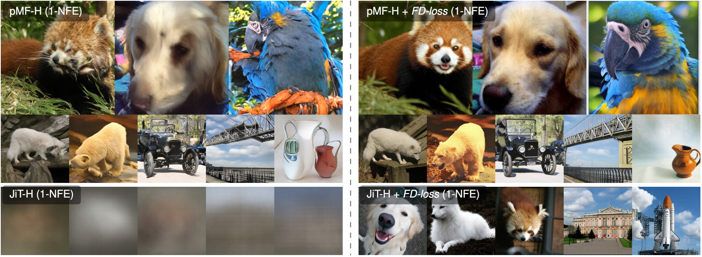

## Representation Fréchet Loss for Visual Generation

[](https://arxiv.org/abs/2604.28190)
[](https://huggingface.co/jjiaweiyang/FD-Loss)

<p align="center">
  
</p>

This is a PyTorch/GPU implementation of the paper:
[Representation Fréchet Loss for Visual Generation](https://arxiv.org/abs/2604.28190).

```bibtex
@article{yang2026fdloss,
  title={Representation Fréchet Loss for Visual Generation},
  author={Yang, Jiawei and Geng, Zhengyang and Ju, Xuan and Tian, Yonglong and Wang, Yue},
  journal={arXiv:2604.28190},
  url={https://arxiv.org/abs/2604.28190},
  year={2026}
}
```

FD-Loss post-trains visual generators by matching generated-image feature
distributions to real-image feature distributions in frozen representation spaces.
This repository includes training, released-checkpoint evaluation, reference
statistics utilities, and scripts for the ImageNet experiments.

<p align="center">
  
</p>

### Dataset

Download ImageNet and place it in your `DATA_ROOT` using the standard
`ImageFolder` layout:

```bash
export DATA_ROOT=/path/to/imagenet
```

### Installation

Download the code:

```bash
git clone https://github.com/Jiawei-Yang/FD-Loss.git
cd FD-Loss
```

Create and activate a conda environment:

```bash
conda create -n fdloss python=3.11 -y
conda activate fdloss

pip install --upgrade pip
pip install torch==2.6.0 torchvision==0.21.0 --index-url https://download.pytorch.org/whl/cu124
pip install -r requirements.txt
pip install -U huggingface_hub
```

### Checkpoints And Statistics

Released checkpoints and data files are hosted on
[Hugging Face](https://huggingface.co/jjiaweiyang/FD-Loss).

```bash
hf download jjiaweiyang/FD-Loss \
  --local-dir . \
  --include "checkpoints/**/*.pth" \
  --include "data/**"

python scripts/extract_paper_ref_stats.py
```

See [scripts/README.md](scripts/README.md) for the asset layout and lighter
download options.

### Evaluation

Evaluate the released FD-SIM models:

```bash
PRESET=pMF_H_256 \
CKPT_PATH=checkpoints/post-trained/pMF-H_FD-SIM.pth \
GPUS_PER_NODE=8 \
bash scripts/evaluate_released_ckpt.sh

PRESET=JiT_H \
CKPT_PATH=checkpoints/post-trained/JiT-H_FD-SIM.pth \
GPUS_PER_NODE=8 \
bash scripts/evaluate_released_ckpt.sh

PRESET=iMF_XL \
CKPT_PATH=checkpoints/post-trained/iMF-XL_FD-SIM.pth \
GPUS_PER_NODE=8 \
bash scripts/evaluate_released_ckpt.sh
```

Additional presets and smoke-test settings are documented in
[scripts/README.md](scripts/README.md).

### Training

Training starts from the released base checkpoints:

```bash
export CKPT_ROOT=./checkpoints/base
```

The experiment scripts under [scripts/](scripts/) reproduce the Table 1
ablations, Table 2 JiT repurposing, and Table 3 scalability runs. For example:

```bash
bash scripts/table_1a_queue_size.sh
bash scripts/table_2_repurpose_jit_L.sh
MODEL_SIZE=L RES=256 bash scripts/table_3_pMF.sh
MODEL_SIZE=XL bash scripts/table_3_iMF.sh
MODEL_SIZE=H bash scripts/table_3_JiT.sh
```

### License

This project is released under the MIT license. See [LICENSE](LICENSE) for details.

If you have any questions, feel free to contact me through email
([yangjiaw@usc.edu](mailto:yangjiaw@usc.edu)).
